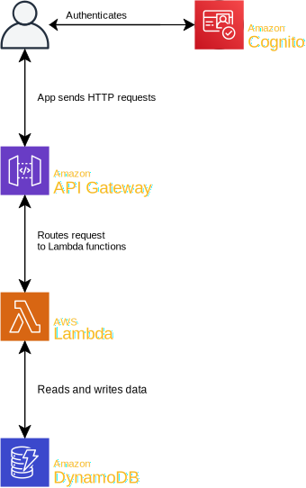

# Shwoop Adventure App Backend

## Getting Started

There are two ways to get started with local development of the Shwoop back end.

One is to use AWS SAM to run a faithful replication of the system as it would behave when deployed to AWS. This would be
ideal, expect getting AWS SAM up and running is difficult. On Windows Home Edition, it doesn’t seem to be possible at
all.

Luckily, there’s an alternative. This project also includes in-JavaScript replicas of API Gateway and DymanoDB. These
are very rough estimations of the real things. They don’t implement any features we are not using. They are even missing
a few we do use. Most notably, endpoints requiring authentication don’t current work. It is however much easier to get
started with. It should good enough for most development work you’ll want to do.

### Easy Mode (Express Server, Fake Database)

1.  **Check you have Node.js and Yarn installed.** Instructions for this can be found in the Front End Getting Started
    guide.

2.  **Install JavaScript dependencies** by running `yarn` from the project root.

3.  **Start the server** by running `yarn start-express` from the project root. You should see an output similar to the
    following. The API will be accessible at `http://localhost:3000`.

        Creating endpoint GetMaps            at get    /maps                                           -> .//maps/get-maps/index:handler
        Creating endpoint GetMap             at get    /maps/:map                                      -> .//maps/get-map/index:handler
        Creating endpoint GetBeacon          at get    /maps/:map/beacon/:beacon                       -> .//maps/get-beacon/index:handler
        Creating endpoint GetChallengePrizes at get    /maps/:map/challenges/:id/prizes                -> .//maps/get-challenge-prizes/index:handler
        Creating endpoint GetPrizeTypes      at get    /prize-types                                    -> .//prize-types/get/index:handler
        Creating endpoint GetPrize           at post   /redemption-codes/:code/                        -> .//prize/get/index:handler
        Creating endpoint DeletePrize        at delete /redemption-codes/:code/                        -> .//prize/delete/index:handler
        Creating endpoint GetUser            at get    /users/:user_id/                                -> .//user/get/index:handler
        Creating endpoint RegisterUser       at post   /users/:user_id/                                -> .//user/register/index:handler
        Creating endpoint StartChallenge     at post   /users/:user_id/challenge/:map/:challenge_id    -> .//user/challenge/start/index:handler
        Creating endpoint StopChallenge      at delete /users/:user_id/challenge                       -> .//user/challenge/stop/index:handler
        Creating endpoint FinishChallenge    at post   /users/:user_id/challenge                       -> .//user/challenge/finish/index:handler
        Creating endpoint ClaimTreasure      at post   /users/:user_id/treasure/:map/:beacon_id        -> .//user/claim-treasure/index:handler
        Creating endpoint GetUserPrizes      at get    /users/:user_id/prizes                          -> .//user/get-prizes/index:handler
        Creating endpoint GetSurvey          at get    /users/:user_id/surveys/new                     -> .//user/survey/get/index:handler
        Creating endpoint FinishSurvey       at post   /users/:user_id/surveys                         -> .//user/survey/finish/index:handler
        Now listening on port 3000

### Hard Mode (AWS SAM)

1.  **Check you have Node.js and Yarn installed.** Instructions for this can be found in the Front End Getting Started
    guide.

2.  **Install JavaScript dependencies** by running `yarn` from the project root.

3.  **Install Docker.** On a Mac, if you have Homebrew installed, run `brew cask install docker`. Otherwise, follow
    [Docker’s instructions](https://www.docker.com/get-started).

4.  **Install the AWS CLI.** On a Mac, `brew install awscli`. On Windows, `choco install awscli`.

    You will also need to add some AWS credentials, even if you’re just running locally. Ask Carl for an access key,
    then run `aws configure --profile shwoop` to enter and save it. Our region is `ap-southeast-2` and you can leave the
    output format blank.

5.  **Install AWS SAM CLI.** On a Mac, `brew install aws-sam-cli`. On Windows, download and run the MSI file linked to
    from [Amazon’s installation instructions](https://docs.aws.amazon.com/serverless-application-model/latest/developerguide/serverless-sam-cli-install-windows.html#serverless-sam-cli-install-windows-sam-cli).

You should now have everything you need installed. A Powershell script to boot it all up can be found in
`scripts/start.ps1`, though of course this will only work on Windows. Here’s what the script does:

1.  **Build the project** with `yarn build`, generating JavaScript code from our TypeScript code. If successful,
    JavaScript assets will be written to the `./build/` folder.

2.  **Start a Docker network** called `lambda-local` with `docker network create lambda-local`. We need a Docker network
    to allow our the Docker containers we’re about to start to talk to each other.

3.  **Run the DynamoDB Docker container.** Amazon provides a pre-built Docker container, ready for us to run. This
    command will take a little while to run the first time as it downloads. It should be faster after that though.

            docker run --detach -p 8000:8000 --network lambda-local --name dynamodb amazon/dynamodb-local -jar DynamoDBLocal.jar -inMemory -sharedDb

4.  **Create our DynamoDB database tables.**

            aws dynamodb create-table --table-name AdventureApp --attribute-definitions AttributeName=id,AttributeType=S --key-schema AttributeName=id,KeyType=HASH --provisioned-throughput ReadCapacityUnits=2,WriteCapacityUnits=1 --endpoint-url http://localhost:8000
            aws dynamodb create-table --table-name AdventureAppPrizes --attribute-definitions AttributeName=id,AttributeType=S --key-schema AttributeName=id,KeyType=HASH --provisioned-throughput ReadCapacityUnits=2,WriteCapacityUnits=1 --endpoint-url http://localhost:8000
            aws dynamodb create-table --table-name AdventureAppUsers --attribute-definitions AttributeName=id,AttributeType=S --key-schema AttributeName=id,KeyType=HASH --provisioned-throughput ReadCapacityUnits=2,WriteCapacityUnits=1 --endpoint-url http://localhost:8000
            aws dynamodb create-table --table-name AdventureAppTelemetry --attribute-definitions AttributeName=id,AttributeType=S --key-schema AttributeName=id,KeyType=HASH --provisioned-throughput ReadCapacityUnits=1,WriteCapacityUnits=10 --endpoint-url http://localhost:8000

5.  **Load a set of database fixtures.** The profile you use must match you profile name you used when you set up AWS
    CLI.

            ts-node ./scripts/upload-database.ts ./resources/dev/AdventureApp.json --db http://localhost:8000 --profile shwoop

6.  **Start the API** using SAM.

            sam local start-api --profile shwoop --env-vars ./resources/dev/local-env.json --docker-network lambda-local

If everything worked, you should now have a more accurate simluation of the API as it would behave in production.

**Once you are finished you must run the following to clean up.** On Windows, you can run `./scripts/stop-sam.ps1`.

```
docker kill dynamodb
docker rm $(docker ps -aq)
docker network remove lambda-local
```

## Architecture

[lambda]: https://aws.amazon.com/lambda/
[aws-sam]: https://docs.aws.amazon.com/serverless-application-model/latest/developerguide/what-is-sam.html
[template]: https://docs.aws.amazon.com/serverless-application-model/latest/developerguide/sam-specification-template-anatomy.html
[api-gateway]: https://aws.amazon.com/api-gateway/
[openapi]: https://swagger.io/specification/
[dynamodb]: https://aws.amazon.com/dynamodb/
[cognito]: https://aws.amazon.com/cognito/
[sam-cli-setup]: #markdown-header-hard-mode-aws-sam
[express-setup]: #markdown-header-easy-mode-express-server-fake-database

The Shwoop Back End runs on AWS. Here we describe which services we use and how they fit together.



### Executing Code

**[Lambda][lambda]**, which takes a set of JavaScript functions and executes them for us when we tell it to. By
providing an abstraction layer over the servers these functions run on, AWS Lambda can dynamically adjust resource
allocation to match demand.

Our Lambda functions are defined in `./template.yaml`, each with the type `AWS::Serverless::Function`. This file is an
[AWS Serverless Application Model][aws-sam] (SAM) [Application Defintion template][template]. It defines all of the
services we use, how they fit together, and where to find the code to deploy to them. For Lambda functions, the source
code can be found in the `./src` directory.

Our functions are written in TypeScript, which Lambda cannot directly execute. Our TypeScript source code is therefore
first compiled into JavaScript, into the `./build` directory. You can start this compilation by running `yarn build`.
The configuration for this build process is in `./tsconfig.build.json`. The output of this process can then be uploaded
to Lambda and run.

Each folder in `./src/` gets uploaded separately and runs in isolation. To share code between Lambdas, we use a system
called [Layers][layers], configured in `./template.yaml` with the `AWS::Serverless::LayerVersion` type. This makes code
in `./src/_common/nodejs/` available from the Lambda at the path `/opt/nodejs`.

Lambdas by themselves are not outwardly visible. To expose them to the world as an HTTP server, we need…

### Handling HTTP Requests

**[API Gateway][api-gateway]**, which sticks a public REST API in front of our Lambda functions, giving us a way to call
them from the mobile app, or any other HTTP client.

Like our Lambda functions, API Gateway is defined an configured in `template.yaml`. In this case, it is the resource
with the type `AWS::Serverless::Api`. However, the bulk of our API Gateway configuration is acutally in another YAML
file referenced from that first defition, `./resources/openapi.yaml`. This file uses the
[OpenAPI specification][openapi] to define all of our API endpoints, their inputs and outputs, and as a place to provide
some basic documentation. This file is consumed by API Gateway to configure our HTTP server.

### Reading and Writing Data

**[DynamoDB][dynamodb]**, a NoSQL database, is where we store most of the Shwoop app’s data. Our DymanoDB tables are
defined in `./template.yaml` with the `AWS::Serverless::SimpleTable` type. In addition, TypeScript interfaces for these
tables are defined in `./src/_common/nodejs/persistence/models/` and a JSON schema for checking the shape of our testing
fixtures is defined in `/resources/adventure-app.schema.json`.

The models in `./src/_common/nodejs/persistence/models/` are used in our Lambda functions to query and update the
database. By default, however, Lambdas are not allowed to access the database at all. Permission must be granted
table-by-table in `./template.yaml`

### Authenticating Users

**[Cognito][cognito]** is a user authentication and authorisation system. When the user registers, they register with
Cognito, rather than with the Shwoop app itself. Once logged in, the user receives a JSON Web Token (JWT) they can use
to prove their identity to the Shwoop back end. JWTs are signed by Cognito, meaning we can cryptographically verify that
they are geniune. They contain basic information about the user, such as their account ID. If the Shwoop back end
receives a JWT that has been signed by Cognito, we can extract their account ID and trust that we know which user is
making the request.

In practice, you won’t need to think about authentication much while working on Shwoop. Our OpenAPI config specifies
which endpoints require authentication and which don’t. API Gateway then enforces this for us, and passes the user’s
information through to the Lambda function if they are authenticated.

## Deploying to AWS

The Shwoop API is deployed in two “stages”: development and production. You’re welcome to deploy to the development
stage whenever you like, for testing or experiments. You won’t break anything important. Leave production deployments to
Carl and Tim for now though.

1.  **Add your AWS access key** by running `aws configure --profile shwoop`. You’ll need to ask Tim or Carl to generate
    a key for you.

2.  **Build the project** by running `yarn build`. This will compile our TypeScript source code into JavaScript that can
    be run in Lambdas.

3.  **Package the SAM project.** This produces a `cloudformation.yaml` file and uploads some assets to S3. The
    `--s3-prefiex` can also be `Production`. Make sure the `--profile` use matches the one you added with
    `aws configure`.

        sam package \
            --template-file template.yaml \
            --s3-bucket adventure-app-cloudformation \
            --s3-prefix Development \
            --output-template-file cloudformation.yaml \
            --profile shwoop

4.  **Deplay the SAM package.** For production deployments, `--stack-name` should be `Production` and
    `--parameter-overrides` should be set to `Stage=Production`.

        sam deploy \
            --template-file ./cloudformation.yaml \
            --stack-name AdventureAppDevelopment \
            --parameter-overrides Stage=Development \
            --capabilities CAPABILITY_IAM \
            --profile shwoop

This process exists as a Powershell script for Windows machines, but I recommend running one command at a time to begin
with.

    powershell scripts/deploy.ps1 Development --profile shwoop

### Uploading database fixtures

Sometimes, you’ll need to populate the database with some actual data. In development, you might want to set up a
certain specific scenario, but even in production you might want to update things like maps and challenges and awards.

The `./resources/` directory includes some JSON fixtures for you to use, and a schema to validate that they have the
correct shape.

To upload a fixture file, run the following. Note that it will only update and adds records. It won’t delete anything.

    npx ts-node ./scripts/upload-database.ts \
        --stage Development \
        --profile shwoop \
        ./resources/dev/AdventureApp.json

## Tooling and Workflows

[front-end-tooling]: https://bitbucket.org/shwoopdevelopment/adventure-app/src/master/README.md#markdown-header-tooling-and-workflows

See the [front end’s README][front-end-tooling] for instructions on setting up your editor and how to make a change.
